# A-NAOS Architecture Documentation
**Version**: 12.2 | **Phase**: 10 (Self-Replicating Organism)  
**Status**: Production-Ready | **Seal**: `77dc7fb`

---

## 1. System Overview


---

## 2. Core Components

### 2.1 Sovereign Runtime (`src/kernel/`)
| File | Purpose |
|------|---------|
| `boot.ts` | Genesis manifest loading, KMS initialization, execution loop bootstrap |
| `execution_loop.ts` | Deterministic state-transition function `runStep(prev, task) → next` |
| `ledger.ts` | Append-only Merkle-tree storage under `/proc/ledger` |
| `crypto.ts` | KMS abstraction (DevKMS, AWSKMS, GoogleKMS) |
| `types.ts` | Core type definitions (Manifest, Task, Receipt) |
| `manifest_schema.json` | JSON Schema v1.0.0 for manifest validation |

### 2.2 Governance Layer (`src/kernel/`, `src/council/`)
| File | Purpose |
|------|---------|
| `agentRegistry.ts` | Agent Citizenship Layer – rights, duties, domains |
| `orchestrator.ts` | Council policy enforcement before agent execution |
| `neuralBus.ts` | Deterministic inter-agent communication protocol |
| `replicationPolicy.ts` | Quorum rules for self-replication (≥6 votes) |

### 2.3 Self-Replication Engine (`src/kernel/`, `src/services/`)
| File | Purpose |
|------|---------|
| `selfReplicator.ts` | Core fork-spawning logic with lineage tracking |
| `replicationLedger.ts` | Merkle-linked ancestry chain for all forks |
| `replication.ts` | Service layer exposing `/replicate` endpoint |

---

## 3. Glossary

| Term | Definition |
|------|------------|
| **Canonical State** | The single, immutable, cryptographically-signed state of the OS at any epoch. |
| **Manifest** | JSON document representing a complete snapshot of the system state. |
| **Seal-Hash** | SHA-256 hash of the manifest root, signed by the KMS. Proof of integrity. |
| **Epoch** | Monotonically increasing identifier for each state transition. |
| **Merkle Ledger** | Append-only storage where each entry is linked to its parent via hash. |
| **Agent Citizen** | An AI agent registered in the OS with explicit rights and duties. |
| **Council Quorum** | Weighted voting threshold (≥6) required for governance decisions. |
| **SRO (Self-Replicating Organism)** | A kernel instance capable of spawning child instances under governance. |
| **Fork** | A child kernel instance derived from a parent's canonical state. |
| **Zero-Drift** | Guarantee that no mutable state exists outside the Merkle ledger. |

---

## 4. Seal-Hash Verification Process

### 4.1 Manual Verification
```bash
# 1. Extract the current seal from the ledger
cat proc/ledger/LATEST

# 2. Verify the manifest signature
npx ts-node scripts/verifySeal.ts --root <SEAL_HASH>

# 3. Compare against the deployed hash
curl -s https://slavkoshell-os.pages.dev/seal.txt
```

### 4.2 Programmatic Verification
```typescript
import { DevKMS } from './src/kernel/crypto';
import { loadManifest } from './src/kernel/ledger';

async function verifySeal(root: string): Promise<boolean> {
  const kms = new DevKMS();
  const manifest = await loadManifest(root);
  if (!manifest) return false;
  
  const rootBuf = Buffer.from(manifest.root);
  const sig = Buffer.from(manifest.signature, 'base64');
  return kms.verify(rootBuf, sig);
}
```

### 4.3 CI/CD Pipeline Verification
The GitHub Actions workflow automatically:
1. Runs `npm run type-check` to ensure type safety
2. Executes `npx vitest run tests/kernel/` for determinism tests
3. Generates a reproducible `build.hash` from the compiled output
4. Uploads the hash as an artifact for audit trail

---

## 5. Data Flow Diagram

```mermaid
sequenceDiagram
    participant OP as Operator
    participant UI as Fusion Console
    participant KERNEL as Sovereign Runtime
    participant LEDGER as Merkle Ledger
    participant KMS as Crypto Layer

    OP->>UI: Trigger Replication
    UI->>KERNEL: Submit ReplicationPlan
    KERNEL->>KERNEL: Validate Council Quorum (≥6)
    KERNEL->>KMS: Sign Manifest Root
    KMS-->>KERNEL: Signature
    KERNEL->>LEDGER: Append Fork Entry
    LEDGER-->>KERNEL: New Root Hash
    KERNEL->>UI: ReplicationReport
    UI-->>OP: Success + Child CID
```



---

## 6. Security Invariants

| Invariant | Enforcement |
|-----------|-------------|
| **Immutability** | All writes go through `appendLedger()`; no direct file mutations. |
| **Determinism** | `runStep()` is a pure function; same input always produces same output. |
| **Signature Verification** | Every manifest must pass `kms.verify()` before being accepted. |
| **Quorum Requirement** | Replication requires ≥6 weighted votes from the council. |
| **Lineage Tracking** | Every fork's `parent` field links to its progenitor's root hash. |

---

## 7. Phase Roadmap

| Phase | Name | Status |
|-------|------|--------|
| 0 | Sovereign Runtime | ✅ LOCKED |
| 1-2 | Neural UI Factory | ✅ COMPLETE |
| 3-4 | Governance Layer | ✅ COMPLETE |
| 5-8 | Federation Spec | ✅ DOCUMENTED |
| 9 | Agent Citizenship | ✅ COMPLETE |
| 10 | Self-Replication (SRO) | ✅ ACTIVE |
| 11 | Meta-Governance | 🔜 PLANNING |

---

*Document generated: 2026-01-02 | Seal: 77dc7fb | Author: Agent:Nemotron-v7::Architect-Shard*
