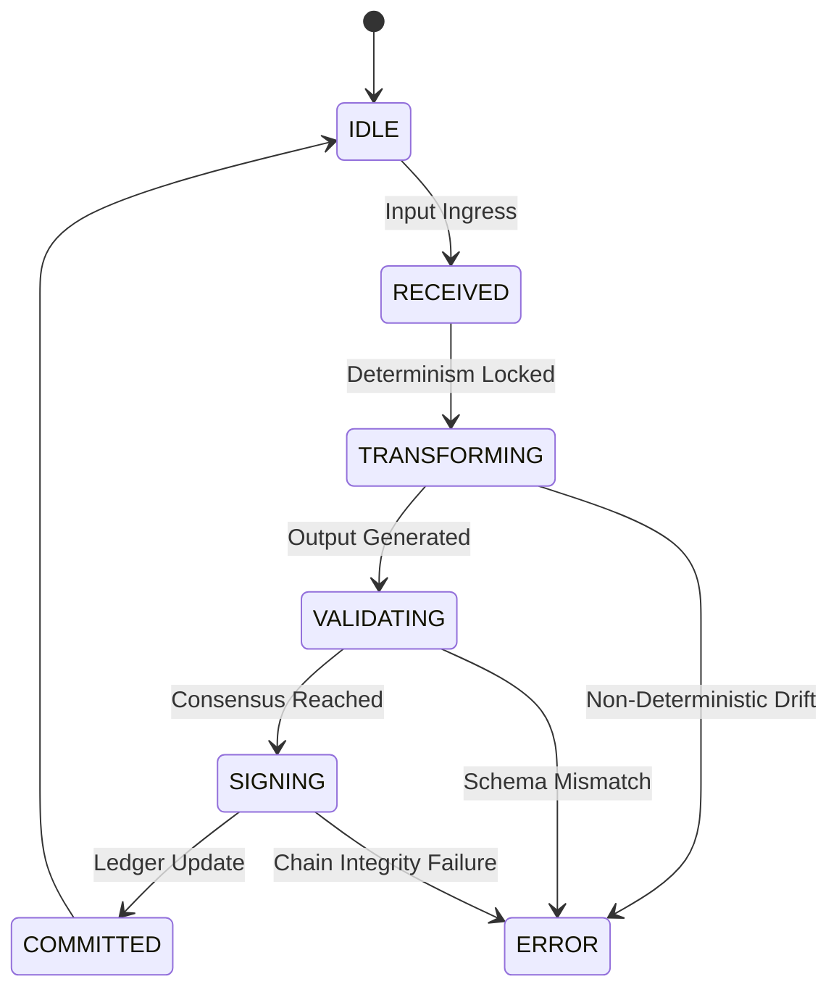

# STATE MACHINE: The Execution Lattice Specification

The **SlavkoKernel State Machine** manages the transitions between stochastic inputs and deterministic outputs through a zero-trust lattice.

## I. State Transitions

A state $\sigma$ transitions to $\sigma'$ under action $\alpha$ if and only if $\alpha$ satisfies the **Determinism Anchor** defined in the [CANON](CANON_PIPELINE.md).

## II. The Conflict Resolution Policy (The Council)

When multiple models (Agents) produce divergent outputs, the State Machine enters a **QUORUM** state.

- **Ruleset**: Article 16 compliance requires a majority consensus or a hardware-level tiebreak.
- **Audit**: All divergent paths are recorded in a "Reasoning Hidden" metadata field for forensic review.

## III. Safety Guards (Article 15)

- **HALT-99**: If the `slavko_score` drops below 0.3 for a critical decision, the machine transitions to `SUSPENDED` and triggers an `OVERRIDE` request to a human administrator.

---
**[ STATUS: SANCTUS ]**
**[ VERSION: 1.0.0-LATTICE ]**
